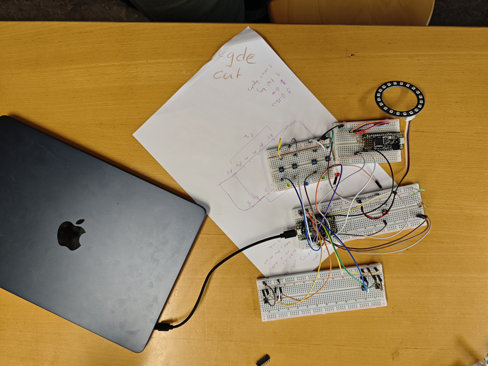
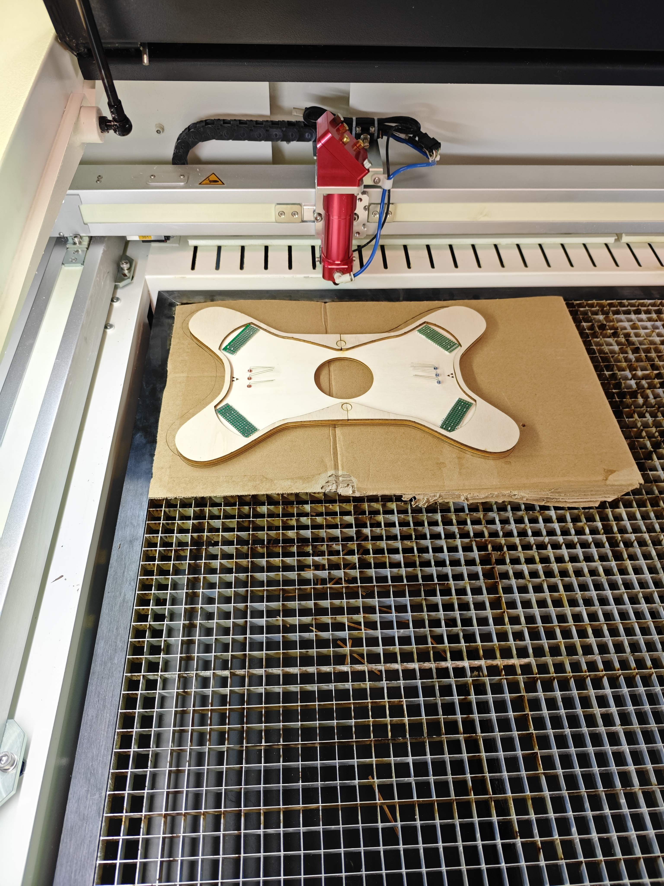

# Reaction Game

A two-player reaction game built on an Adafruit Feather M4 Express.
A central NeoPixel ring flashes a colour and players race to press the matching
button before a time window closes. The window shrinks after every round.

## Game modes

On boot you land on a **mode-select** screen: the ring shows a constant colour for the selected game,
the **MODE** button cycles between games, and **START** confirms and launches.

### Game 1 — Reaction
The ring flashes a colour and each player races their own clock to hit the match.
Each player has 3 lives. The window shrinks each round; first to 0 lives loses.

### Game 2 — Duel
Turn-based sudden death. The active player's HP LEDs light to show whose turn it
is (randomized), and they must hit the colour shown on the ring. A correct press passes the
turn and shrinks the window; a wrong press **or** a timeout loses the game.

More game modes can be added.

## Controls

From either game-over screen: **START** replays the same game, **MODE** returns
to the mode selector.

## Hardware

- [Bills of material (BOM)](docs/bills_of_material.svg)
- [Schematic](docs/schematic.svg)
- [Parts to assemble](docs/parts_to_assemble.svg)
- [Laser-cut chassis](design/laser_cut.svg)
- [3D-printed button caps](design/Button_print.scad) (OpenSCAD)

## Assembly

1. Gather parts from the [BOM](docs/bills_of_material.svg).
2. Laser-cut the chassis from [design/laser_cut.svg](design/laser_cut.svg).
3. 3D-print ten button caps from [design/Button_print.scad](design/Button_print.scad).
4. Wire the board following the [schematic](docs/schematic.svg) and [parts](docs/parts_to_assemble.svg).
5. Mount buttons, buzzers, HP LEDs, and the NeoPixel ring into the chassis and solder connections.
6. Upload the game and test.
7. Have fun!

## Software setup

1. Install the [Arduino IDE](https://www.arduino.cc/en/software).
2. Add board support for **Adafruit Feather M4 Express** via the [Adafruit board package](https://learn.adafruit.com/add-boards-arduino-ide).
3. Install libraries through the Library Manager:
   - [Adafruit NeoPixel](https://github.com/adafruit/Adafruit_NeoPixel)
   - [Bounce2](https://github.com/thomasfredericks/Bounce2)
4. Open `reaction_game.ino`, select **Adafruit Feather M4 Express**, and upload.

## Gallery

| Stage | Photo |
| --- | --- |
| Breadboard prototype |  |
| Cardboard form-factor sketch |  |
| Laser-cutting the chassis |  |

## License

Licensed under the [MIT License](LICENSE).
